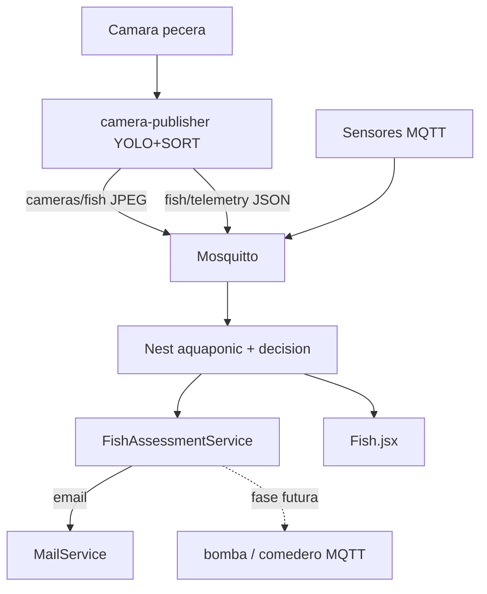

# Plan: IA de peces → conducta → correo (AquaGia OS)

Estado: **MVP implementado** en `preview` (detección Aquarium + SORT + telemetría + correo).
Pendiente de upgrade: **reentreno con AnnotateDeepFish**.

## Objetivo

1. Detectar / trackear peces.
2. Inferir conducta: superficie, movilidad `active` | `normal` | `low`.
3. Emitir probabilidades de alerta (O₂/hambre, malestar) cuando aplique.
4. Enviar evaluación por correo (`MailService`).
5. No activar aún bomba/comedero; payload listo para la capa de decisiones.

## Arquitectura



## Implementado

| Pieza | Ubicación |
|-------|-----------|
| Modelo Aquarium (yolo11s) | `fish-detection/models/fish_yolo11s_aquarium.pt` (local, no git) |
| Detect + SORT + conducta | `camera-publisher/fish_ai/` |
| Publicador MQTT | `camera-publisher/camera_publisher.py` |
| Correo de evaluación | `backend/src/decision/fish-assessment.service.ts` |
| UI conteo / actividad | `frontend/src/pages/Fish.jsx` |
| Train / DeepFish scripts | `fish-detection/scripts/` |

### Estados de actividad

| `activityState` | Significado |
|-----------------|-------------|
| `active` | Se mueven mucho (saludable) |
| `normal` | Movimiento habitual |
| `low` | Poca movilidad → posible “estén mal” |

Superficie prolongada → probabilidad de falta de oxígeno o hambre (independiente del estado de actividad).

### Topics

- `aquaponic/cameras/fish` — frames (+ overlay)
- `aquaponic/fish/telemetry` — count, behavior, assessment

### API

- `GET /decision/fish-assessment`
- `POST /decision/fish-assessment/now`

## Reentreno con DeepFish (upgrade)

Dataset de referencia: [alzayats/DeepFish](https://github.com/alzayats/DeepFish).  
Para YOLO con boxes usar **AnnotateDeepFish** (Roboflow):  
https://universe.roboflow.com/deepfish/annotatedeepfish

```powershell
cd fish-detection
python -m venv .venv
.\.venv\Scripts\activate
pip install -r requirements.txt

# 1) Descargar AnnotateDeepFish (requiere API key de Roboflow)
$env:ROBOFLOW_API_KEY="tu_key"
python scripts/download_deepfish.py

# 2) Entrenar (preferible GPU; en CPU usa menos epochs)
python scripts/train.py `
  --data datasets/deepfish/data.yaml `
  --model yolo11n.pt `
  --epochs 80 `
  --batch 8 `
  --device 0 `
  --name fish_deepfish

# 3) Apuntar el publisher al nuevo peso
# En camera-publisher/.env:
# FISH_DETECT_MODEL=../fish-detection/models/fish_yolo_best.pt
```

Recomendación: mezclar DeepFish con frames propios de la pecera (IR, turbidez, tilapia) para mejor generalización.

## Criterio de listo (MVP)

- Video/cámara: conteo y `activityState` llegan al dashboard.
- Si superficie o baja actividad sostenidas: correo con texto de probabilidad + sensores.
- Sin comandos a actuadores por esta vía (aún).
