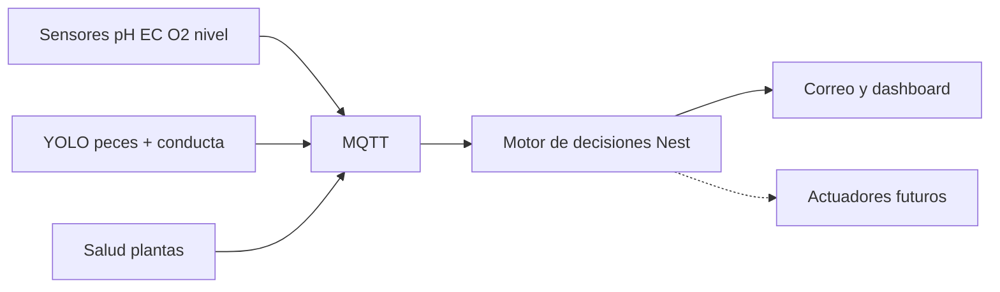

# Pregunta de investigación y diseño del sistema de decisiones (AquaGia OS)

Propuesta grupo CSI · Metodología de investigación · Sistema acuapónico AquaGia

---

## 1. Formulación original (a mejorar)

> Evaluar la toma de decisiones para una IA que permita la simbiosis de plantas y peces en el cultivo acuapónico.

**Problemas de esa redacción**

- Mezcla “evaluar” (validación experimental) con un objeto aún en fase de diseño.
- “Permita la simbiosis” es ambiguo: la simbiosis es biológica; la IA **apoya el equilibrio**, no “crea” la simbiosis.
- No indica **con qué datos** decide (peces, plantas, agua).

---

## 2. Pregunta de investigación (recomendada)

> ¿Cómo se puede diseñar un sistema de toma de decisiones basado en IA que, a partir del estado de peces, plantas y parámetros físico-químicos del agua, apoye el equilibrio simbiótico en un sistema acuapónico?

### Por qué solo “diseñar”

- Enfoca el aporte en la **arquitectura** (visión + sensores → hipótesis → acciones).
- Evita prometer una evaluación experimental completa si el piloto largo aún no está cerrado.
- Encaja con AquaGia: ya hay un diseño implementable; la validación va como **objetivo específico / fase**, no en la pregunta central.

### Cuándo sí usar “diseñar y evaluar”

Si el entregable exige prueba formal (métricas, comparación con operador humano, piloto en tanque real) durante el mismo periodo del trabajo.

---

## 3. Objetivos

| Tipo | Formulación |
|------|-------------|
| **General** | Diseñar un sistema de toma de decisiones basado en IA para apoyar el equilibrio simbiótico en un cultivo acuapónico. |
| **Específico 1** | Integrar la percepción del estado de peces, plantas y parámetros del agua en un bus común (MQTT) y un motor de decisión. |
| **Específico 2** | Definir hipótesis probabilísticas y acciones recomendadas ante desequilibrios (O₂, alimentación, hongos, nutrientes, recirculación, etc.). |
| **Específico 3** | Realizar una **validación preliminar** de alertas en escenarios controlados (telemetría/demo + casos de desequilibrio). |

---

## 4. Enfoque metodológico

Estudio **aplicado de diseño de sistemas**:

1. **Diseño** de la arquitectura híbrida de percepción y decisión.
2. **Implementación** en el monorepo AquaGia (dashboard, backend NestJS, cámaras, modelos).
3. **Validación preliminar** (fase posterior a la pregunta central): escenarios controlados, contraste con criterio experto, métricas de acierto y falsas alarmas.

No se plantea, en la pregunta principal, una evaluación clínica o un ensayo largo en producción.

---

## 5. Diseño del sistema en AquaGia

La “IA de simbiosis” **no es un único modelo**: es un pipeline que fusiona tres fuentes de estado.

### 5.1 Peces (visión)

| Elemento | Detalle |
|----------|---------|
| Modelo | YOLOv11s + SORT (dataset Aquarium; upgrade DeepFish) |
| Señales | Conteo, `activityState` (`active` / `normal` / `low`), `surfaceRatio` |
| Hipótesis | Falta de oxígeno o hambre (superficie); malestar (poca movilidad) |
| Salida | `aquaponic/fish/telemetry` + correo (`FishAssessmentService`) |
| Ubicación | `fish-detection/`, `camera-publisher/fish_ai/` |

### 5.2 Plantas (visión)

| Elemento | Detalle |
|----------|---------|
| Pipeline | Segmentación ExG + EfficientNet / heurísticas de color |
| Datasets | PlantVillage (clasificación); PlantDoc (YOLO, upgrade) |
| Hipótesis | Infección fúngica, color anormal/deficiencia, manchas, estrés |
| Salida | `aquaponic/plants/telemetry` + correo (`PlantAssessmentService`) |
| Ubicación | `plant-detection/`, `camera-publisher/plant_ai/` |

### 5.3 Agua (sensores)

Parámetros físico-químicos vía MQTT (pH, electroconductividad, oxígeno, nivel, nitratos, CO₂, etc.).

- Reglas en tiempo real: p. ej. bomba de recirculación por histéresis de nivel (`PumpDecisionService`).
- Contexto de las alertas de peces y plantas en el correo de evaluación.

### 5.4 Motor de decisiones (fase actual)

1. Recibe telemetría de visión + sensores.
2. Emite `assessment` con probabilidades y mensajes legibles.
3. Adjunta `suggestedActions` (recomendaciones, no comandos ciegos).
4. Notifica por correo y dashboard.
5. Deja hooks para actuadores futuros (bomba, comedero, dosificación, aireación).

### 5.5 Modelo conceptual de simbiosis

- Los **peces** generan carga orgánica y reflejan estrés (conducta, O₂, alimentación).
- El **agua** debe mantener rangos óptimos (pH, EC, oxígeno, nivel).
- Las **plantas** absorben nutrientes y manifiestan desequilibrios (clorosis, hongos, manchas).

Si conducta de peces + sensores y/o salud foliar + pH/EC se desvían, el sistema eleva la probabilidad de desequilibrio y sugiere intervención, apoyando el equilibrio simbiótico.

---

## 6. Validación preliminar (fuera de la pregunta central)

Criterios sugeridos cuando se ejecute la fase de evaluación:

| Criterio | Pregunta |
|----------|----------|
| Correctitud | ¿La alerta coincide con un desequilibrio real (experto / bitácora)? |
| Oportunidad | ¿Llega antes de un daño visible grave? |
| Calibración | ¿Un 70 % de riesgo se asocia a más casos verdaderos que un 40 %? |
| Integración | ¿La decisión usa peces + plantas + agua, no solo una fuente? |
| Seguridad | Cooldown anti-spam; override manual; sin actuadores automáticos prematuros |

**Protocolo breve**

1. Escenarios controlados (video + telemetría demo): superficie, inactividad, hoja amarilla/manchada, O₂ bajo.
2. Comparar alerta del sistema vs. criterio de un operador.
3. Registrar aciertos, falsos positivos/negativos y tiempo a alerta.
4. (Fase 2) Cerrar el lazo con actuadores y medir recuperación de parámetros.

---

## 7. Respuesta sintética (para el documento CSI)

> El sistema se diseña como una arquitectura híbrida en AquaGia: modelos de visión para el estado de peces y plantas, sensores físico-químicos del agua y un motor de decisiones que emite hipótesis de riesgo con probabilidad y acciones sugeridas (aireación, alimentación, nutrientes, recirculación), apoyando el equilibrio simbiótico sin depender de un único modelo. La evaluación se contempla como fase posterior de validación preliminar de alertas, no como el eje de la pregunta de investigación.

---

## 8. Referencias internas del proyecto

| Documento | Contenido |
|-----------|-----------|
| [docs/fish-detection-plan.md](./fish-detection-plan.md) | Plan IA peces |
| [docs/plant-detection-plan.md](./plant-detection-plan.md) | Plan IA plantas |
| [docs/model-weights.md](./model-weights.md) | Pesos a descargar / entrenar |
| `backend/src/decision/` | Motor Nest (bomba, fish/plant assessment, reportes) |
| `camera-publisher/` | Cámaras + inferencia MQTT |

---

## 9. Glosario breve

| Término | Significado en este trabajo |
|---------|------------------------------|
| Simbiosis acuapónica | Relación pez–agua–planta en equilibrio productivo |
| Hipótesis probabilística | Mensaje tipo “Probabilidad de X % de …” con evidencia |
| `suggestedActions` | Recomendaciones para el operador o para actuadores futuros |
| Enfoque híbrido | Visión (IA) + sensores + reglas de decisión |
