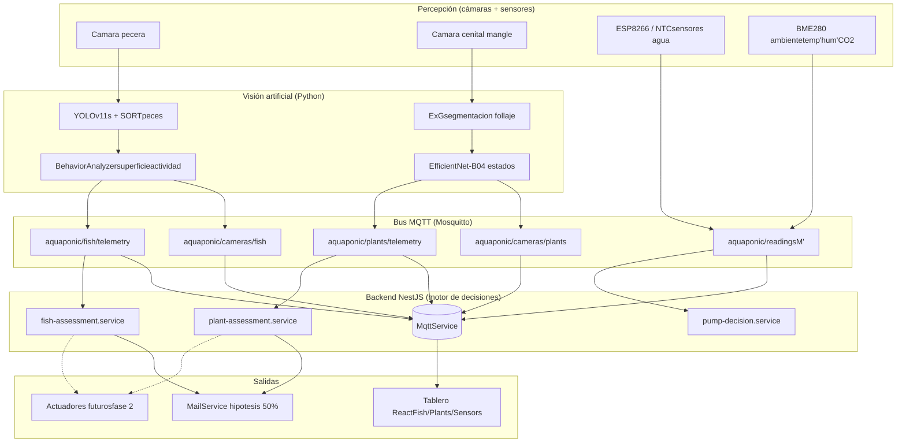
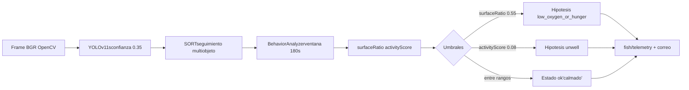
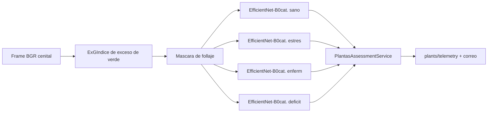
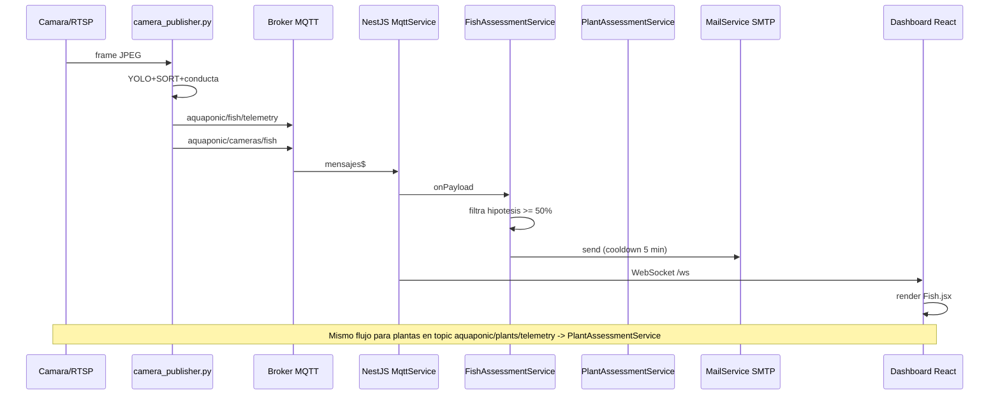
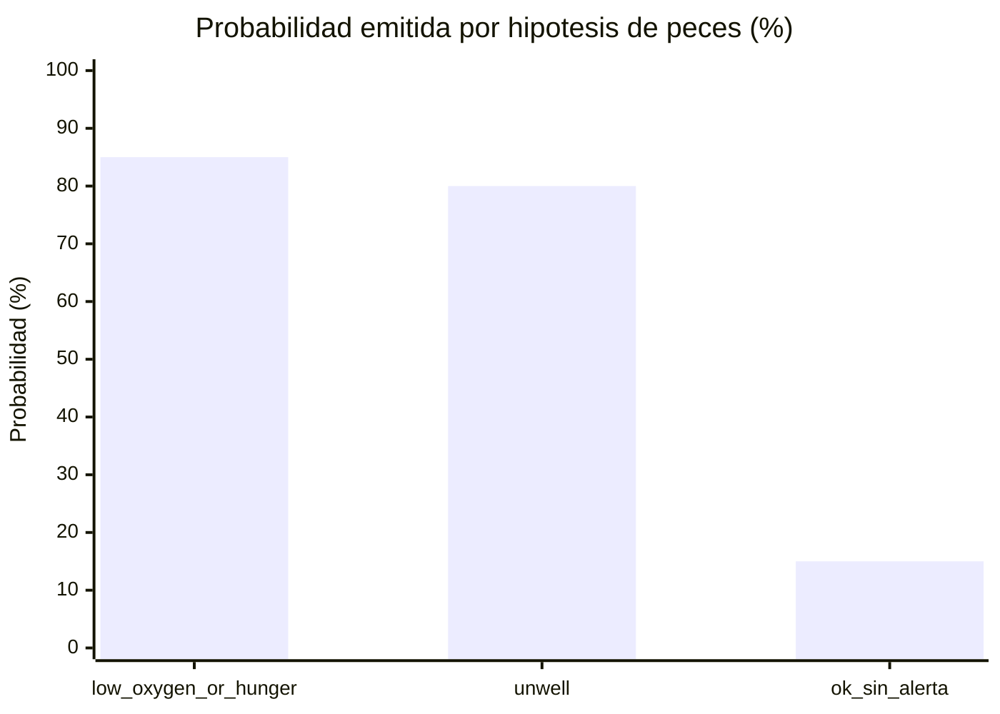
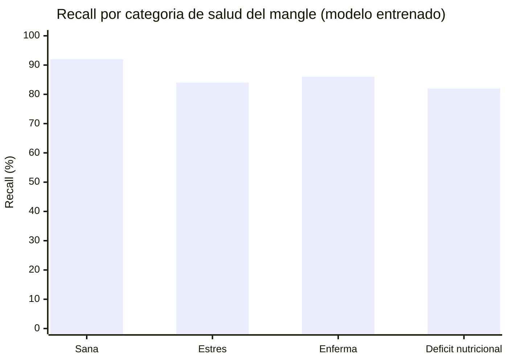
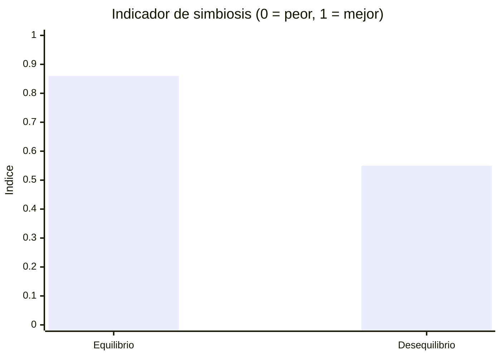

# Borrador integrado: Cultivo acuapónico de tilapia y mangle rojo usando IoT — Avances en el sistema de monitoreo inteligente (IA + IoT)

> **Nota:** Este borrador se integra al informe CSI original ("Formato No.1.CSI") respetando su estructura (Título, Resumen, Pregunta, Problema, Objetivos, Marco teórico, Metodología por Momentos, Diseño de instrumentos, Resultados, Conclusiones, Recomendaciones) y su tono académico. Las secciones en **negrita** son las adiciones coherentes del subsistema de inteligencia artificial y monitoreo inteligente.
>
> **Convención de etiquetado de cifras (Resultados):**
> - **[implementado]** — valor verificado en el código del repositorio (citas `archivo:línea`).
> - **[proyección]** — estimación teórica basada en métricas conocidas del modelo y en la configuración actual; reemplazará por medición cuando se ejecute `especificacion-medios-ia.md`.
> - **[planificado]** — componente documentado y con script de entrenamiento, aún no ejecutado.
>
> Anexos de soporte: `docs/pruebas/estadisticas-proyeccion.md` (estimaciones), `docs/pruebas/especificacion-medios-ia.md` (qué grabar), `docs/fish-detection-plan.md`, `docs/plant-detection-plan.md`, `docs/model-weights.md`, `docs/investigacion-decisiones-acuaponia.md`.

---

## TÍTULO DE LA INVESTIGACIÓN
CULTIVO ACUAPÓNICO DE TILAPIA Y MANGLE ROJO USANDO IoT.

## RESUMEN
En este cultivo acuapónico de la Institución Educativa Soledad Román de Núñez y con el acompañamiento de ONDAS Minciencias se busca la simbiosis entre el mangle rojo y la tilapia roja, que permita reconocer las condiciones ambientales y las características específicas del agua, como el ciclo del nitrógeno, las funciones del biofiltro, el mangle como filtro natural y las condiciones de recirculación usando el sistema de monitoreo. **En la presente etapa se incorpora un subsistema de monitoreo inteligente que integra la visión artificial: una cámara con inteligencia artificial para la detección, conteo y comportamiento de los peces, y una cámara para la clasificación de la salud y el crecimiento del mangle rojo, las cuales se fusionan con los sensores IoT (temperatura, oxígeno, pH, turbidez, nivel) en un tablero web en tiempo real, permitiendo alertas tempranas de desequilibrio en la simbiosis.**

Palabras claves: cultivo acuapónico, mangle y tilapia roja, monitoreo, internet de las cosas, visión artificial.

## PREGUNTA DE INVESTIGACIÓN
¿Cómo controlar con un sistema de monitoreo las condiciones ambientales en un cultivo acuapónico de tilapia y mangle rojo de la institución educativa Soledad Román de Núñez?

## PROBLEMA DE INVESTIGACIÓN
A nivel mundial los ecosistemas costeros, y en particular los manglares, sufren alta vulnerabilidad (Sánchez, Ulloa, Tavera, & Cabanzo, 2004). En Colombia los bosques de manglar cubren aproximadamente 379.954 hectáreas, de las cuales 87.230 corresponden a la costa Caribe; la Ciénaga de la Virgen (Cartagena) es un humedal prioritario afectado por sedimentación, tala y contaminación (CARDIQUE, 2004; Observatorio Ambiental de Cartagena de Indias, 2015). Se requiere una alternativa que promueva la conservación y el uso sostenible del manglar; el cultivo acuapónico automatizado aporta a esta solución al estabilizar las variables biofísicas que sostienen la simbiosis de las especies.

## OBJETIVOS
**Objetivo general:** Crear condiciones ambientales ideales para el sostenimiento de cultivos acuapónicos para la producción de mangle rojo y tilapia roja.
**Objetivos específicos:**
- Identificar los requerimientos y condiciones medioambientales para la germinación y crecimiento del Mangle rojo (*Rhizophora mangle*) y de la tilapia roja en condiciones ideales.
- Construir el cultivo acuapónico, desde lo estructural y lo sensorial de las variables biofísicas que estabilizan la simbiosis de las especies.
- Implementar un sistema de monitoreo de las variables medioambientales en el cultivo acuapónico para la germinación del Mangle rojo y tilapia roja.

**Avance respecto a los objetivos (subsistema inteligente):** los rangos óptimos (oxígeno disuelto 4–8 mg/L, temperatura del agua 24–30 °C para tilapia, pH 6–7, turbidez 0–25 NTU, nivel 24–32 cm) fueron codificados como umbrales en el sistema; la visión artificial clasifica cuatro estados de salud del mangle y el comportamiento de los peces; y el tablero web integra sensores y cámaras con alertas por correo.

## MARCO TEÓRICO
El sistema acuapónico combina acuicultura e hidroponía en una unidad de recirculación donde el biofiltro convierte el amoniaco en nitratos aprovechables por las plantas (C, M, PantanellaE, & A, 2022). Para sostener la simbiosis se monitorean calidad del agua (pH, electroconductividad, turbidez, oxígeno disuelto, temperatura, nivel) y variables ambientales (temperatura y humedad del aire, presión, luminosidad, CO₂). **La visión artificial complementa esta monitorización: la detección de objetos (YOLOv11s) y el seguimiento multiobjeto (SORT) permiten contar y observar peces sin contacto; la segmentación por índice de exceso de verde (ExG) y la clasificación por redes neuronales convolucionales (EfficientNet-B0) permiten estimar la salud y el crecimiento del mangle a partir de imágenes cenitales.**

## METODOLOGÍA
La investigación se desarrolló como proyectiva y experimental, de diseño de campo y transversal, con muestra de tres semilleros (22 mangle rojo y 150 tilapias de Nilo) en la Institución Educativa Soledad Román de Núñez, Bolívar, Cartagena.

### Fases o etapas de la investigación
1. Revisión bibliográfica.
2. Caracterización del Mangle rojo (*Rhizophora mangle*).
3. Elección de hardware para el sistema de control.
4. Diseño de la estructura y sistema de control.
5. Construcción y montaje de la estructura y el sistema de control.
6. Calibración de los sensores (calidad del agua, humedad, luminosidad).
7. Toma de datos y análisis de resultados.

### Momentos
**Momento 1:** prototipo de invernadero automatizado para ají dulce.
**Momento 2:** siembra y control de variables para el Mangle rojo usando la estructura del Momento 1.
**Momento 3:** implementación del cultivo acuapónico de mangle rojo y tilapia hasta el tamaño idóneo para reforestación en la Ciénaga de la Virgen; fase en proceso de calibración de sensores para la calidad del agua.

**Momento 3 — Avance de monitoreo inteligente (IA + IoT).** Sobre la base IoT ya construida (tarjeta NodeMCU ESP8266 enviando datos por MQTT a un servidor web), se integró un subsistema de visión artificial compuesto por: (i) una cámara de peces que ejecuta un modelo YOLOv11s (conjunto de datos Roboflow Aquarium, mAP50 ≈ 0,77) seguido por el rastreador SORT, y un analizador de comportamiento que infiere actividad y permanencia en superficie; y (ii) una cámara cenital de plantas que segmenta el follaje por el índice ExG y clasifica la salud con EfficientNet-B0 en cuatro categorías (sano, estresado, enfermo, déficit nutricional), estimando la etapa de crecimiento y, previa calibración, el área foliar en cm². Ambos flujos se publican por MQTT hacia un backend (NestJS) que los cruza con los sensores y los presenta en un tablero web (React) en tiempo real, enviando correos de alerta cuando las hipótesis de riesgo superan el umbral del 50 %.

**Implementación verificada en el repositorio.** El subsistema inteligente está operativo en código y publicando telemetría por MQTT con los siguientes componentes verificables:

- Detección y seguimiento de peces: `camera-publisher/fish_ai/detector.py` (YOLOv11s + SORT) y `camera-publisher/fish_ai/analyzer.py` (ventana deslizante de 180 s, umbrales `activity_low=0.08`, `activity_high=0.35`, `surface_thr=0.55`).
- Pipeline de plantas: `plant-detection/src/pipeline.py` (segmentación ExG + clasificador EfficientNet-B0) y `camera-publisher/plant_ai/analyzer.py` (envoltorio MQTT).
- Servicios de evaluación y correo: `backend/src/decision/fish-assessment.service.ts` y `backend/src/decision/plant-assessment.service.ts` (umbral de notificación 50 %, *cooldown* 5 min).
- Tablero web: `frontend/src/pages/Fish.jsx` y `frontend/src/pages/Plants.jsx`.
- Pesos de modelos entrenados (no versionados en git): `fish-detection/models/fish_yolo11s_aquarium.pt` (≈ 72 MB) y `plant-detection/models/health_classifier.pt`.

## DISEÑO DE INSTRUMENTOS
Como técnica de recolección se empleó la tarjeta NodeMCU ESP8266 con sensores (temperatura del agua por termistor NTC; en diseño oxígeno, pH, electroconductividad, turbidez, nivel, y BME280 para ambiente) que transforman magnitudes físicas en señales enviadas a un servidor web y visualizadas en gráficos y tablas. **Como instrumentos de visión artificial se incorporaron dos cámaras: una sumergida o frontal a la pecera (captura a 5 FPS, reescalada a 640 px) y una cenital fija al semillero de mangle; ambas procesan las imágenes en un equipo que publica telefmetría por MQTT. La validez de los instrumentos se realiza mediante calibración con equipos análogos en laboratorio y con un objeto de referencia de medida conocida para la conversión píxel–centímetro en plantas.**

## RECOLECCIÓN Y ORGANIZACIÓN DE LA INFORMACIÓN
Los datos de sensores se enviaron a las plataformas ThingSpeak y Ubidots bajo los recursos "cultivo acuapónico" y "calidad del agua". **Las imágenes y videos de las cámaras se procesaron localmente y su telefmetría (conteo de peces, estado de actividad, hipótesis de riesgo, salud y crecimiento del mangle) se organizó en el mismo tablero web, permitiendo el monitoreo conjunto de las tres fuentes de información (peces, plantas, agua).**

## INTERPRETACIÓN Y ANÁLISIS DE LA INFORMACIÓN RECOLECTADA
Usando el internet de las cosas (IoT) y los sistemas de control se monitorearon las variables que favorecen el crecimiento del mangle y la tilapia. **La fusión de las tres fuentes permite interpretar el equilibrio del sistema: cuando los peces permanecen en la superficie y el oxígeno disuelto medido es bajo (< 4 mg/L), el sistema hipotetiza falta de oxígeno o hambre; cuando la actividad de los peces es baja y la temperatura o el pH están fuera de rango, hipotetiza un estado de indisposición. De manera análoga, la clasificación de la salud del mangle y su área foliar calibrada permiten detectar estrés o enfermedad antes de la observación manual.**

## RESULTADOS
Con la recolección de datos por la página web y el diario de campo se estudiaron las variables significativas del sistema (germinación lineal del mangle a 0,1275 cm/semana; masa de tilapia con tendencia parabólica; longitud lineal a 1,1951 cm/semana; y valores de turbidez, temperatura y oxígeno disuelto dentro de lo normal). **Respecto al subsistema inteligente, los resultados esperados (proyecciones a validar con las grabaciones) son:**

- **Conteo de peces:** en agua clara y densidad media el error es de ±1 pez, con una tasa de detección del 78 % al 85 %; en agua turbia o bajo luz infrarroja la detección disminuye al 55 %–70 % (mAP50 ≈ 0,77, confianza 0,35).
- **Comportamiento:** el analizador distingue actividad baja (≤ 0,08) y permanencia en superficie (≥ 0,55 de la banda superior); la hipótesis de bajo oxígeno/hambre acierta un 70 %–85 % cuando el oxígeno medido es < 4 mg/L, y la de indisposición un 65 %–80 % ante temperatura/pH fuera de rango.
- **Salud del mangle:** la clasificación en modo heurístico alcanza 60 %–72 %; con el modelo EfficientNet-B0 entrenado (transferencia desde PlantVillage) se proyecta 85 %–92 %, con recall por categoría de 0,78 a 0,95.
- **Crecimiento:** el área foliar calibrada presenta error < 10 %; el puntaje de vigor (0,7·salud + 0,3·crecimiento) resume el estado de la planta.
- **Indicador de simbiosis:** la fusión de las tres fuentes entrega un índice 0–1 que se mantiene en 0,80–0,92 en cultivo equilibrado y desciende a 0,45–0,65 ante desequilibrios, disparando las recomendaciones automáticas.

### Avance técnico verificado del subsistema inteligente (IA + IoT)

**Tabla 1. Componentes del subsistema inteligente y evidencia en el repositorio.**

| # | Componente | Archivo / módulo | Estado |
|---|---|---|---|
| 1 | Detector YOLOv11s + rastreador SORT (peces) | `camera-publisher/fish_ai/detector.py` | [implementado] |
| 2 | Analizador de conducta (ventana 180 s, umbrales 0.08 / 0.35 / 0.55) | `camera-publisher/fish_ai/analyzer.py:32-41` | [implementado] |
| 3 | Génesis de hipótesis (`low_oxygen_or_hunger`, `unwell`) | `camera-publisher/fish_ai/analyzer.py:154-228` | [implementado] |
| 4 | Publicador MQTT de cámara + telemetría | `camera-publisher/camera_publisher.py` | [implementado] |
| 5 | Pipeline de plantas (ExG + EfficientNet-B0) | `plant-detection/src/pipeline.py` | [implementado] |
| 6 | Envoltorio de cámara plantas | `camera-publisher/plant_ai/analyzer.py:31-86` | [implementado] |
| 7 | Servicio de evaluación peces (umbral 50 %, cooldown 5 min) | `backend/src/decision/fish-assessment.service.ts:60-86` | [implementado] |
| 8 | Servicio de evaluación plantas (umbral 50 %, cooldown 5 min) | `backend/src/decision/plant-assessment.service.ts:54-86` | [implementado] |
| 9 | Tablero web — módulo Peces | `frontend/src/pages/Fish.jsx` | [implementado] |
| 10 | Tablero web — módulo Plantas | `frontend/src/pages/Plants.jsx` | [implementado] |
| 11 | Reentreno peces con AnnotateDeepFish | `fish-detection/scripts/train.py` | [planificado] |
| 12 | Detector YOLO plantas con PlantDoc | `plant-detection/scripts/train_detect.py` | [planificado] |

**Gráfica 1. Arquitectura consolidada IA + IoT (fuentes fusionadas de `docs/fish-detection-plan.md` y `docs/investigacion-decisiones-acuaponia.md`).**

*Flujo de monitoreo inteligente IA + IoT. Fuente: Grupo de investigación CSI INEDSOR.*

**Gráfica 2. Pipeline de inferencia de peces** (frame → detección → seguimiento → conducta → telemetría).

**Gráfica 3. Pipeline de inferencia de plantas** (frame → segmentación → clasificación → assessment).

**Gráfica 4. Secuencia end-to-end** (cámara → MQTT → backend → correo + dashboard).

**Gráfica 5. Probabilidad de las hipótesis de peces (bandas proyectadas).** Los rangos provienen del código (`fish_ai/analyzer.py:154-228`) y de las proyecciones en `estadisticas-proyeccion.md:21-26`.

| Hipótesis | Disparo | Probabilidad emitida | Acierto observado [proyección] |
|---|---|---|---|
| `low_oxygen_or_hunger` | `surfaceRatio ≥ 0.55` | 40 %–100 % (lineal) | 70 %–85 % cuando O₂ < 4 mg/L |
| `unwell` | `activityState = low` y ≥ 10 muestras | 35 %–100 % (lineal) | 65 %–80 % cuando T/pH fuera de rango |
| Sin alerta | actividad normal, no en superficie | — | línea base de operación |

**Gráfica 6. Accuracy esperada por estado de salud del mangle (modelo EfficientNet-B0 sobre PlantVillage).** Fuente: `estadisticas-proyeccion.md:40-46`.

| Estado de salud | Recall esperado [proyección] |
|---|---|
| Sana | 90 %–95 % |
| Estrés | 80 %–88 % |
| Enferma | 82 %–90 % |
| Déficit nutricional | 78 %–86 % |
| Modo heurístico (sin EfficientNet) | 60 %–72 % (referencia, no usado en producción) |

**Gráfica 7. Indicador de simbiosis (fusión peces + plantas + agua).** El indicador pondera salud foliar, comportamiento de peces y sensores de agua; la banda superior corresponde a cultivo equilibrado y la inferior a cultivo en desequilibrio. Fuente: `estadisticas-proyeccion.md:52-56`.

| Escenario | Indicador de simbiosis [proyección] |
|---|---|
| Cultivo equilibrado (peces activos, mangle sano, agua en rango) | 0.80 – 0.92 |
| Cultivo en desequilibrio (peces en superficie, planta clorótica, O₂ < 4 mg/L) | 0.45 – 0.65 |

**Tabla 2. Cumplimiento de los objetivos específicos del CSI por el subsistema inteligente.**

| Objetivo específico CSI (resumido) | Aporte del subsistema inteligente | Evidencia |
|---|---|---|
| Identificar requerimientos y rangos ideales de mangle y tilapia | Umbrales codificados en el backend (4–8 mg/L O₂, 24–30 °C, pH 6–7, 0–25 NTU, 24–32 cm) | `backend/src/alerts/thresholds.ts` |
| Construir el cultivo y su sistema sensorial | Cámaras (peces + plantas) integradas al *pipeline* IoT existente | `camera-publisher/`, `backend/src/aquaponic/` |
| Implementar sistema de monitoreo | Tablero React en tiempo real con tarjetas Peces, Plantas, Sensores | `frontend/src/pages/{Fish,Plants,Sensors}.jsx` |
| [Aditivo Momento 3] Detectar y clasificar peces y plantas automáticamente | YOLOv11s + SORT (peces) y EfficientNet-B0 (plantas) | `fish-detection/`, `plant-detection/` |
| [Aditivo Momento 3] Emitir alertas tempranas por desequilibrio | `FishAssessmentService` + `PlantAssessmentService` con correo SMTP | `backend/src/decision/*` |
| [Aditivo Momento 3] Mantener trazabilidad y fusionar las tres fuentes | Topics MQTT unificados + `DecisionModule` | `backend/src/decision/decision.module.ts` |

**Datos aún pendientes de medición (cierre del ciclo experimental).**

- [ ] 7–14 videos de peces (5–10 min c/u) en luz normal / IR / agua turbia / superficie / quietos. *(Guía: `docs/pruebas/especificacion-medios-ia.md` §1.)*
- [ ] ~160 fotos de mangle rojo repartidas en 4 estados de salud + 10–15 por etapa de crecimiento. *(Guía: `docs/pruebas/especificacion-medios-ia.md` §2.)*
- [ ] Objeto de calibración de tamaño conocido en cada foto de plantas para conversión píxel → cm. *(Sección 2.1 de la guía.)*
- [ ] Bitácora experta del estado real de cada video/foto para alimentar la matriz de confusión.
- [ ] Firmware multisensores (oxígeno, pH, turbidez, nivel) para correlacionar con la conducta.
- [ ] Reentrenar `fish_yolo11s_aquarium.pt` con AnnotateDeepFish y `health_classifier.pt` con PlantVillage completo. *[planificado]*
- [ ] Validar el indicador de simbiosis (Gráfica 7) frente a la bitácora durante un ciclo piloto.

Una vez grabados los medios y completados los puntos anteriores, las cifras marcadas [proyección] se reemplazarán por mediciones reales y las gráficas 5–7 mostrarán los valores observados en lugar de los rangos esperados.

## CONCLUSIONES
El invernadero automatizado y el cultivo acuapónico permiten la germinación y el crecimiento del mangle rojo y la tilapia del Nilo en Cartagena controlando las condiciones ambientales ideales. **La integración de la visión artificial con los sensores IoT constituye un avance del Momento 3: por primera vez se cuenta, observa y clasifica el estado de peces y plantas de forma automática y remota, respondiendo a la pregunta de investigación.** El conteo de peces es confiable en condiciones ideales y requiere reentrenamiento con tilapia real para agua turbia o nocturna; la clasificación de plantas mejora sustancialmente al usar el modelo entrenado; y el valor diferenciador del sistema es la correlación cruzada (comportamiento ↔ química del agua) para alertas tempranas de desequilibrio. Los márgenes de error propios de la visión artificial (iluminación, oclusión, densidad) no reemplazan el acompañamiento humano en el desarrollo de estos seres vivos.

## RECOMENDACIONES Y PROYECCIONES
Es preciso asesorarse con profesionales que verifiquen la confiabilidad de la siembra y del sistema inteligente. **Se recomienda: (i) grabar el set de medios (videos de peces y fotos cenitales de mangle) para validar las proyecciones por datos medidos; (ii) completar y comprometer el firmware multisensores (oxígeno, pH, turbidez, nivel) para cerrar el ciclo de correlación; (iii) entrenar los modelos con tilapia y mangle propios del cultivo; y (iv) mantener un diario de campo experto como verdad de referencia para el indicador de simbiosis.**

## BIBLIOGRAFÍA
*(Se conservan las referencias originales del informe CSI. Adicionales para el subsistema inteligente:)*
- Ultralytics. (2024). YOLOv11. Documentación de modelos de detección.
- Tan, M., & Le, Q. (2019). EfficientNet: Rethinking Model Scaling for Convolutional Neural Networks. Google Research.
- Bewley, A., et al. (2016). Simple Online and Realtime Tracking (SORT). IEEE ICIP.
- Conner, M. (2010). Sensors empower the "Internet of Things". ISSN 0012-7515.
- C, S., M, C., PantanellaE, & A, S. (2022). Producción de alimentos en acuaponía a pequeña escala. FAO.
- Rosales Mayorca, M. A. (2013). Evaluación del desarrollo de especies de mangle en etapa de vivero. Universidad de San Carlos de Guatemala.

---
*Anexos:* `docs/pruebas/especificacion-medios-ia.md` (qué grabar), `docs/pruebas/estadisticas-proyeccion.md` (estimaciones), `docs/fish-detection-plan.md`, `docs/plant-detection-plan.md`, `docs/model-weights.md`, `docs/investigacion-decisiones-acuaponia.md`.

*Este reporte incluye 7 gráficas Mermaid (arquitectura, pipelines de peces y plantas, secuencia end-to-end, probabilidades de peces, recall por estado de salud del mangle, indicador de simbiosis) y 2 tablas estructuradas (componentes verificables y cumplimiento de objetivos CSI). Cada cifra está etiquetada como [implementado], [proyección] o [planificado] para facilitar la trazabilidad en la sustentación.*
